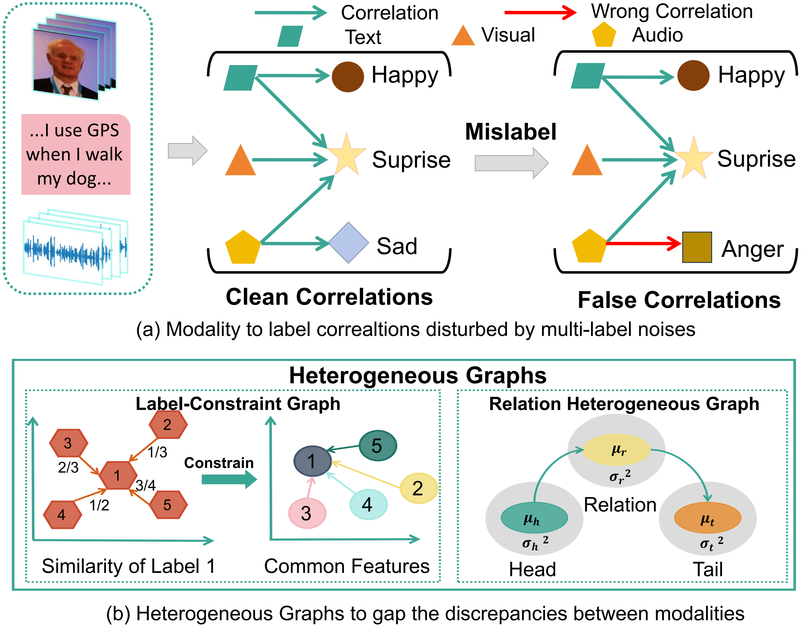

# HGE
## Usage
### Prerequisites
- Python 3.8
- PyTorch 1.9.0
- CUDA 11.4

### Datasets
Data files (containing processed MOSEI datasets) can be downloaded from [Aligned](https://drive.google.com/file/d/1A7HTBxle5AOFt66mqNIRDM3DOws_tNXH/view) [Unaligned](https://pan.baidu.com/s/1w600ia_V_NlLcLhNp9TSbw&key=wy4s).
Please put the downloaded datasets into `./data` directory.

## Motivation


## Method Introduction
.png "Framework")

 ### Run the Codes
 You can select the training dataset in train.sh. If you want to train on Aligned MOSEI, add `--aligned`, and if you want to train on Unaligned MOSEI, add `--unaligned_mask_same_length`. 
 Training the model as below:
 ```python
bash train.sh
 ```
By default, the trained model will be saved in `./model_saved` directory.
